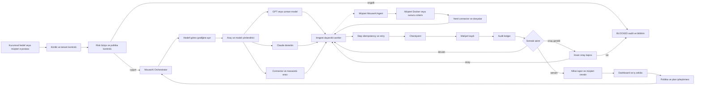
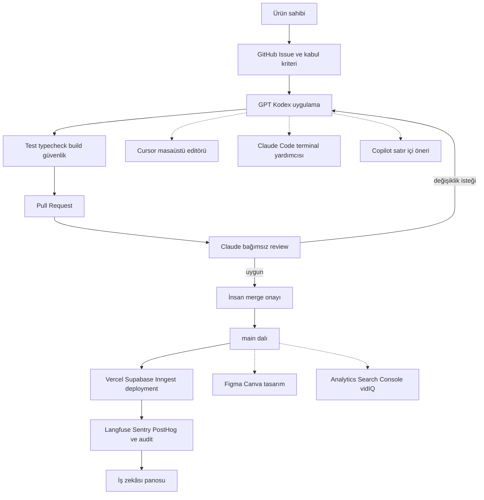
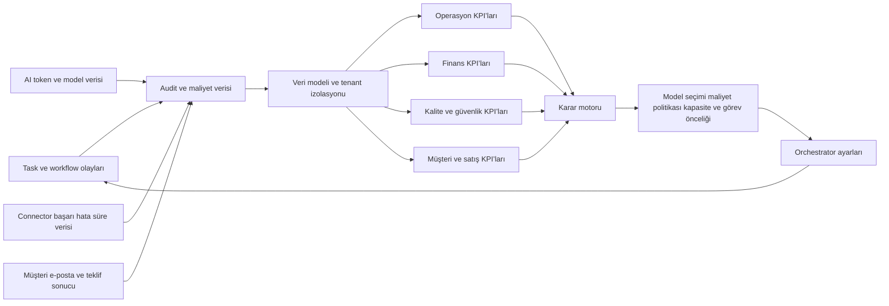

# MouseAI Son Akış ve İş Zekâsı Diyagramı

## Ana iş akışı

## Görev ve araç paylaşımı

## İş zekâsı geri besleme döngüsü

## İş zekâsı göstergeleri

| Alan | Temel göstergeler | Karar |
|---|---|---|
| Operasyon | Tamamlanma oranı, bekleme süresi, retry oranı, checkpoint’ten devam oranı | Worker kapasitesi ve öncelik |
| Maliyet | Task başı maliyet, model başı maliyet, tenant kredi tüketimi, bütçe aşımı | Model ve araç yönlendirme |
| Kalite | Hata oranı, review değişiklik oranı, müşteri memnuniyeti, tekrar iş oranı | Prompt, politika ve denetim |
| Güvenlik | BLOCKED oranı, yetkisiz erişim denemesi, secret tarama sonucu, L3/L4 onay sayısı | Politika sertleştirme |
| Satış | Tekliften dönüşüm, cevap süresi, indirim oranı, kaybedilen talepler | Teklif ve müşteri asistanı |
| SEO | Organik trafik, dönüşüm, içerik üretim maliyeti, anahtar kelime kazanımı | İçerik ve reklam planı |

## Akışın çalışma sırası

1. Kullanıcı veya müşteri e-postası sisteme girer.
2. Kimlik, tenant, rol, risk ve bütçe kontrol edilir.
3. Orchestrator hedefi görev grafiğine çevirir.
4. GPT/Kodex üretim veya planlama görevini yapar.
5. Claude denetim, güvenlik ve kalite görevini yapar.
6. Gerekirse connector veya masaüstü aracı kontrollü olarak çağrılır.
7. Inngest worker işi retry, checkpoint ve idempotency ile yürütür.
8. Maliyet, audit, kalite ve sonuç verileri kaydedilir.
9. Yüksek riskli işlemde insan onayı alınır.
10. Nihai çıktı müşteriye veya kullanıcıya gönderilir.
11. İş zekâsı katmanı sonucu analiz eder ve sonraki görev politikasını iyileştirir.

## Başlangıç noktası

İlk canlı olmayan demo şu senaryodur:

`hedef gir → task oluşur → worker çalışır → mock AI seçilir → checkpoint yazılır → maliyet ve audit oluşur → dashboard sonucu gösterir`

Bu senaryo geçmeden gerçek müşteri e-postası, ödeme, WhatsApp veya canlı masaüstü işlemi açılmaz.

## Hibrit yürütme eklemesi

İş yükü, `MouseAI Agent` üzerinden müşterinin Docker, Kubernetes, masaüstü veya özel bulut ortamında çalıştırılabilir. Cloud kontrol düzlemi task, politika, lisans, audit özeti ve iş zekâsını korur; Agent ise müşterinin yerel API, CRM, ERP, dosya ve masaüstü işlemlerini yürütür. Ayrıntılı karar `customer-hosted-agent-architecture.md` içindedir.
