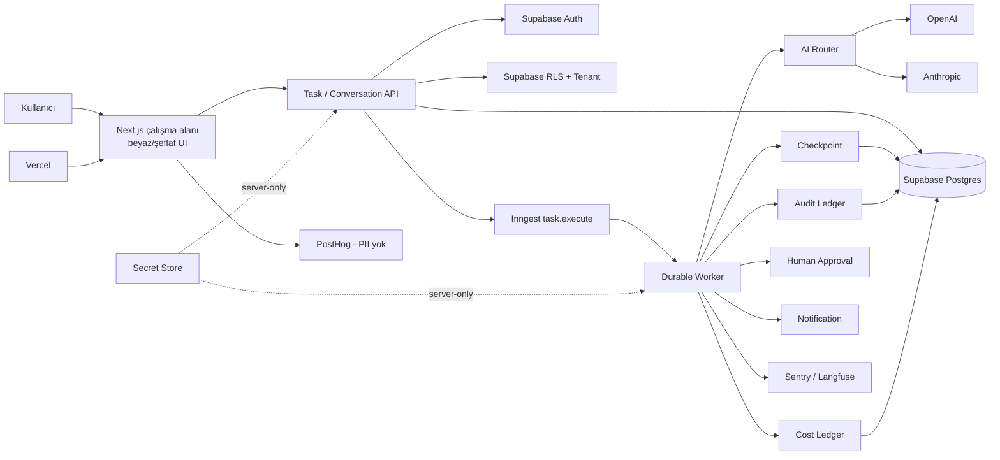

# MouseAI - A'dan Z'ye Proje Yol Haritasi

**Repo:** `hakimceliker/mauseai`  
**UI referansi:** Beyaz/şeffaf MouseAI çalışma alanı ekranı  
**Kural:** Main'e doğrudan push yok; her değişiklik branch -> PR -> CI -> review -> merge sırasındadır.

## 1. Hedef ürün

MouseAI, kullanıcının doğal dille hedef verdiği; hedefi task'a, task'ı dayanıklı workflow adımlarına dönüştüren; AI ajanlarını, insan onayını, maliyetleri, audit kayıtlarını ve tenant izolasyonunu birlikte yöneten bir operasyon platformudur.

Temel akış:

```text
Kullanıcı hedefi
  -> Task API
  -> plan / policy kontrolü
  -> Inngest task.execute
  -> AI / browser / CRM adımları
  -> checkpoint + audit + cost
  -> insan onayı gerekiyorsa WAITING_APPROVAL
  -> çıktı / rapor / bildirim
```

## 2. Sistem diyagramı



## 3. Durum özeti

| Alan | Durum | Sonraki kanıt |
|---|---|---|
| Next.js / TypeScript / CI | Tamam | Main CI |
| Supabase migration / RLS kodu | Kod tamam | Gerçek tenant negatif testi |
| Vercel health/readiness | Tamam | Redeploy sonrası tekrar kontrol |
| Inngest worker | Kod tamam | Canlı task.execute run |
| AI adapter'ları | Kod tamam | Gerçek provider çağrısı |
| UI design system | Temel tamam | Ekranların referansa göre uygulanması |
| Audit / cost | Kod tamam | Canlı workflow kayıtları |
| Production kabulü | Bekliyor | Auth + tenant + Inngest dört kapısı |

## 4. Aşamalar ve görev sahipleri

### Aşama 0 - Yönetim ve kaynak doğrulama

**Sahip:** Codex/GPT  
**Denetçi:** Claude  
**Çıktı:** Merkezi yol haritası, doküman envanteri, branch/PR kanunu.

- `docs/mouseai-full-project-roadmap.md`
- `docs/document-inventory.md`
- `docs/task-registry.md`
- `docs/production-acceptance-task-distribution.md`
- PR #82 proxy düzeni doğrulandı.
- PR #75 readiness duplicate olarak merge edilmeden kapatıldı.

### Aşama 1 - Kod iskeleti ve kalite kapıları

**Görev:** MOUSE-001  
**Ana dosyalar:** `package.json`, `tsconfig.json`, `.github/workflows/`, `.env.example`

- TypeScript strict.
- ESLint, Prettier, test ve build komutları.
- GitHub quality, dependency-audit, secret-scan ve Docker işleri.
- `.env.local` sadece yerel; secret commit edilmez.

```json
{
  "scripts": {
    "lint": "eslint .",
    "typecheck": "tsc --noEmit",
    "test": "vitest",
    "build": "next build",
    "verify": "npm run lint && npm run typecheck && npm run test -- --run && npm run build"
  }
}
```

**Kabul:** lint, typecheck, test, build, audit, secret scan ve Docker yeşil.

### Aşama 2 - Mimari inceleme standardı

**Görev:** MOUSE-002  
**Ana dosyalar:** `docs/review/architecture-review-standard.md`, `.github/pull_request_template.md`

- Scope dışı değişiklik reddedilir.
- Tenant sınırı ve server/client ayrımı kontrol edilir.
- Secret ve PII kontrolü yapılır.
- Retry ve idempotency davranışı belgelenir.
- Review sonucu `APPROVE`, `CHANGES_REQUESTED` veya `BLOCKED` olur.

### Aşama 3 - Supabase migration, Auth ve RLS

**Görev:** MOUSE-003  
**Ana dosyalar:** `supabase/migrations/*.sql`, `src/lib/db/supabase.ts`, `src/lib/auth/`, `tests/security/`

```sql
create policy tenant_select on public.tasks
for select using (tenant_id in (
  select tenant_id from public.tenant_members
  where user_id = auth.uid()
));
```

- Migration sırası bozulmaz.
- RLS açık olmadan production kabul edilmez.
- Service role yalnızca server-side kullanılır.
- Tenant A/B çapraz erişim testleri zorunludur.

### Aşama 4 - Vercel deployment

**Görev:** MOUSE-004  
**Ana dosyalar:** `vercel.json`, `docs/deploy/vercel-deployment.md`, `src/app/api/health/`

- Production ve Preview environment ayrılır.
- `NEXT_PUBLIC_*` yalnızca public değerler içindir.
- Service role, Inngest signing ve AI key frontend’e girmez.
- Redeploy sonrası health/readiness testi yapılır.

```text
GET /api/health       -> 200
GET /api/health/ready -> 200, {"ready":true}
```

### Aşama 5 - Inngest durable workflow

**Görev:** MOUSE-005  
**Ana dosyalar:** `src/inngest/functions/execute-task.ts`, `src/inngest/functions/task-worker.ts`, `src/app/api/inngest/`

```ts
export const executeTask = inngest.createFunction(
  { id: 'task-execute', retries: 3 },
  { event: 'task.execute' },
  async ({ event, step }) => {
    const plan = await step.run('plan', () => createPlan(event.data));
    return step.run('execute', () => executePlan(plan));
  },
);
```

- Geçici hata: normal `throw`.
- Kalıcı hata: `NonRetriableError`.
- Her etkili step checkpoint ve audit üretir.
- Aynı iş tekrarında yan etki iki kez oluşmaz.

### Aşama 6 - AI router ve provider'lar

**Görevler:** MOUSE-006 OpenAI, MOUSE-007 Anthropic  
**Ana dosyalar:** `src/lib/ai/ai-router.ts`, `src/lib/ai/providers/openai.ts`, `src/lib/ai/providers/anthropic.ts`

```ts
export function requireCredential(name: string): string {
  const value = process.env[name];
  if (!value) throw new Error(`credential_not_configured:${name}`);
  return value;
}
```

- Provider seçimi policy üzerinden yapılır.
- Key yalnızca server-side okunur.
- Timeout/rate-limit/retry ayrımı korunur.
- Prompt ve yanıt loglanırken hassas veri maskelenir.
- Credential yoksa sahte PASS verilmez.

### Aşama 7 - Stripe sandbox

**Görev:** MOUSE-008  
**Ana dosyalar:** `src/lib/integrations/payment-adapter.ts`, `src/app/api/webhooks/stripe/route.ts`

- Sadece test mode.
- Webhook imzası doğrulanır.
- Aynı webhook idempotent işlenir.
- Canlı ödeme, gerçek kart ve gerçek müşteri kullanılmaz.

### Aşama 8 - Beyaz/şeffaf UI design system

**Görev:** MOUSE-009  
**Ana dosyalar:** `src/styles/tokens.ts`, `src/app/globals.css`, `docs/design/design-system.md`

Tasarım yönü:

- Beyaz ana zemin.
- Şeffaf/frosted kartlar.
- İnce gri sınırlar.
- Mavi birincil aksiyon.
- Yeşil canlılık/başarı durumu.
- Sarı bekleme, kırmızı hata.
- Sol navigasyon, üst global arama, sağ görev devri/aktivite paneli.

```css
:root {
  --surface: #ffffff;
  --surface-glass: rgb(255 255 255 / 0.78);
  --border: #e5e7eb;
  --text: #111827;
  --muted: #64748b;
  --primary: #1677ff;
  --success: #16a34a;
  --warning: #d97706;
  --danger: #dc2626;
  --radius-card: 16px;
}
```

Ekranlar:

1. Çalışma Alanı / dashboard.
2. Görev gelen kutusu.
3. Task ayrıntısı ve timeline.
4. Sağ canlı aktivite paneli.
5. AI ekip kartları.
6. Onay bekleyen işler.
7. Maliyet ve güvenlik raporu.
8. Ayarlar, entegrasyonlar ve sistem durumu.

### Aşama 9 - Observability

**Görev:** MOUSE-010  
**Ana dosyalar:** `src/lib/observability/index.ts`, `src/lib/logging/error-logger.ts`, `src/lib/ai/ai-router.ts`

- Sentry hata event’i.
- Langfuse AI trace.
- Correlation ID.
- Task/step/provider/latency/maliyet ilişkisi.
- Token, key, e-posta ve full body maskesi.

### Aşama 10 - Product analytics

**Görev:** MOUSE-011  
**Ana dosyalar:** `src/lib/integrations/posthog-provider.ts`, `src/lib/integrations/analytics-provider.ts`

- `task_created`.
- `task_started`.
- `task_completed`.
- `task_failed`.
- `approval_requested`.
- `provider_selected`.
- PII gönderilmez; tenant yalnızca anonim group olarak tutulur.

### Aşama 11 - Production acceptance

**Sahip:** Codex/GPT  
**İnsan kapısı:** Kullanıcı  
**Denetçi:** Claude

```text
Auth: PASS
Tenant isolation: PASS
Inngest workflow: PASS
Production logs/audit: PASS
Final decision: ACCEPT
```

Bu dört PASS olmadan production kabulü verilmez.

## 5. Dosya sahipliği

| Alan | Sorumlu | Ana klasör |
|---|---|---|
| API ve domain | Codex | `src/app/api/`, `src/lib/domain/` |
| Auth/RLS | Codex + Supabase | `supabase/`, `src/lib/auth/` |
| Worker | Codex + Inngest | `src/inngest/` |
| AI | Codex + OpenAI/Anthropic | `src/lib/ai/` |
| UI | Codex + tasarım referansı | `src/app/`, `src/styles/` |
| Gözlemleme | Codex + Sentry/Langfuse | `src/lib/observability/` |
| Analytics | Codex + PostHog | `src/lib/integrations/` |
| Denetim | Claude | PR diff ve `docs/review/` |
| Secret/hesap/onay | Kullanıcı | Vercel, Supabase, Inngest panelleri |

## 6. Her PR için teslim şablonu

```text
Repo: hakimceliker/mauseai
Branch: <branch>
Task: <MOUSE-ID>
Yapılan değişiklik: <özet>
Değişen dosyalar: <liste>
Çalıştırılan testler: lint, typecheck, test, build, audit, Docker
Başarılı test sayısı: <sayı>
Başarısız testler: <yok veya liste>
Secret durumu: configured / credential_not_configured
Rollback: git revert <merge commit>
Kalan engel: <liste>
Sıradaki adım: <tek adım>
PR bağlantısı: <GitHub URL>
```

## 7. Sonraki gerçek işlem sırası

1. Supabase test kullanıcısı.
2. Tenant A/B ve üyelikler.
3. Inngest production sync.
4. `SMOKE_WORKFLOW_ID` test workflow’u.
5. Auth ve tenant acceptance runner.
6. Inngest task.execute acceptance runner.
7. Checkpoint/audit/retry/idempotency kanıtı.
8. AI provider, observability ve analytics canlı testleri.
9. Claude bağımsız review.
10. Final acceptance ve production kararı.

## 8. Kalan engeller

- Gerçek Auth test hesabı.
- İki boş test tenant’ı.
- Runtime test token’ları.
- Inngest production workflow ID.
- Canlı worker/checkpoint/audit kanıtı.
- Retry/idempotency canlı kanıtı.
- OpenAI/Anthropic gerçek provider testi.
- Sentry/Langfuse/PostHog gerçek event testi.
- Stripe sandbox webhook replay kanıtı.
- Realtime bağlantı kanıtı.
- Eski MOUSE draft PR’larının duplicate olarak kapatılması.

**Nihai kural:** Credential veya canlı kanıt yoksa durum `credential_not_configured` / `NOT_RUN` olarak kalır; sistem sahte PASS üretmez.


